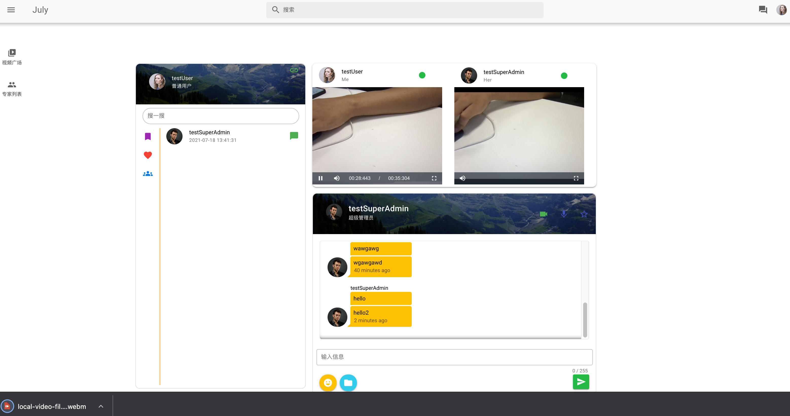
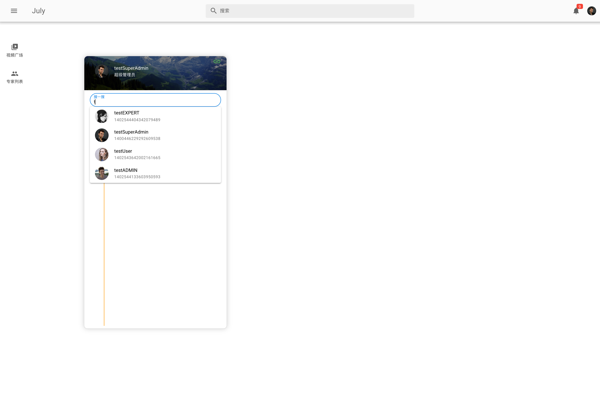
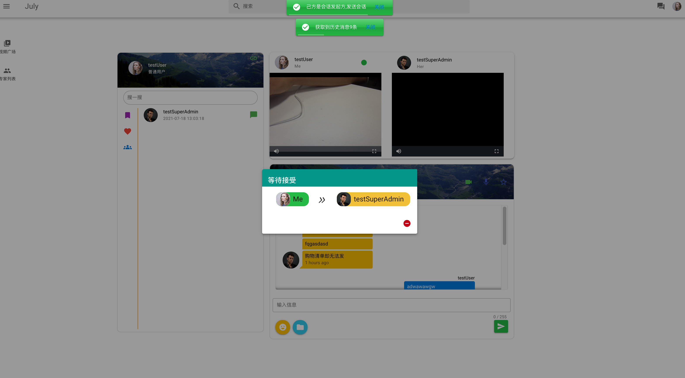
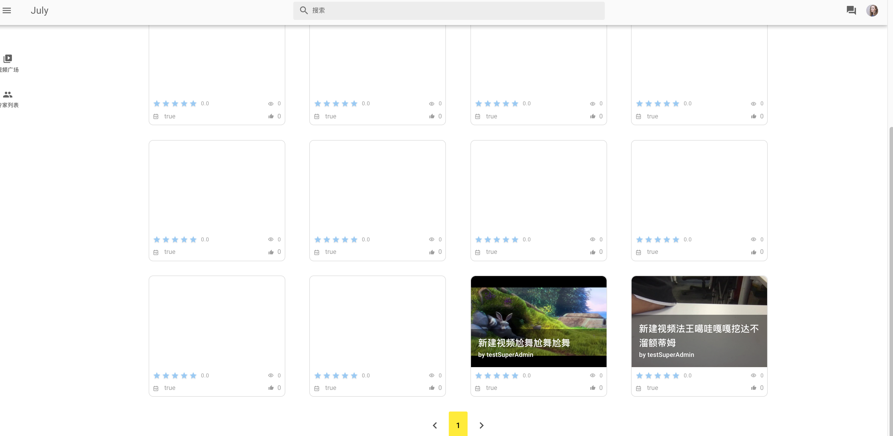
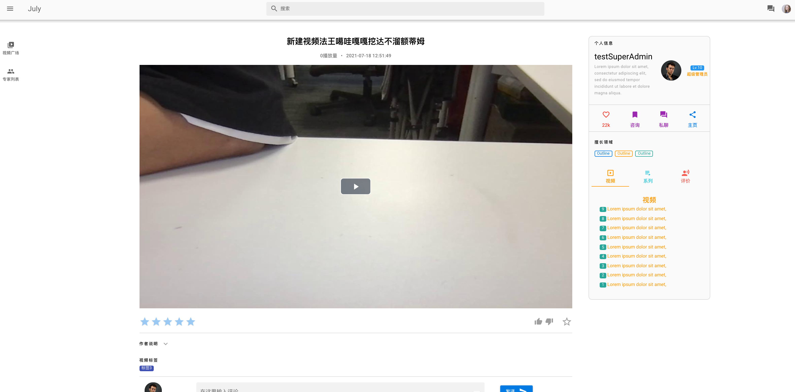
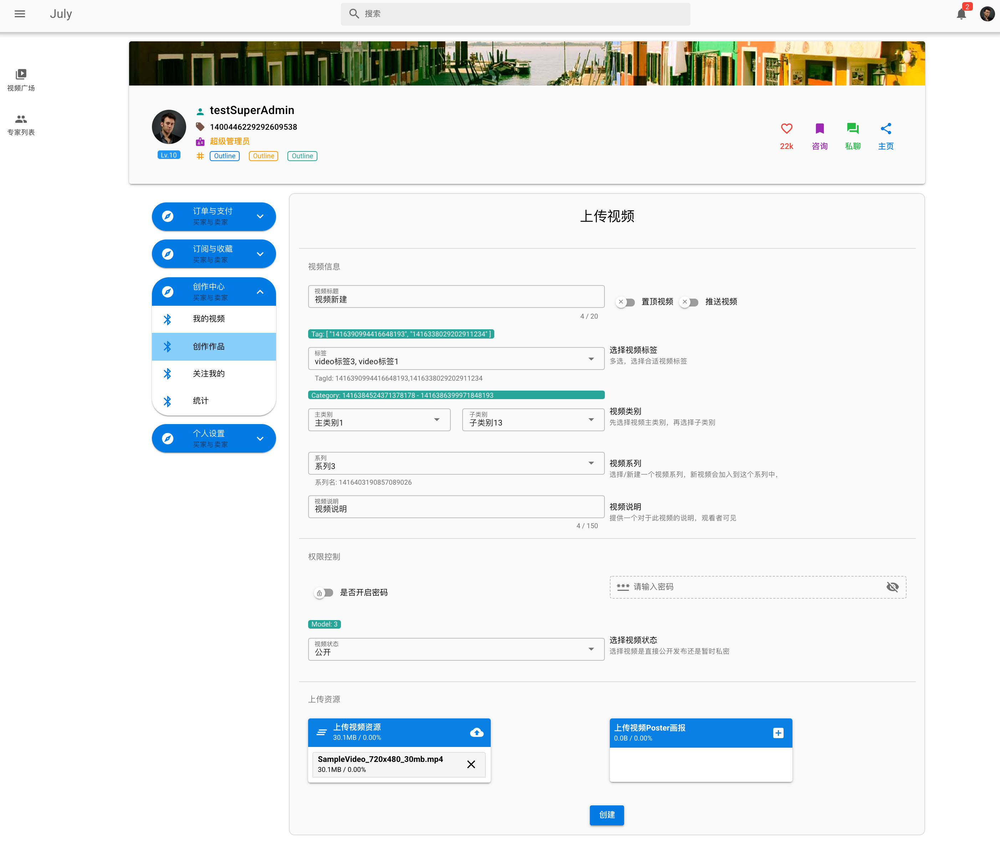
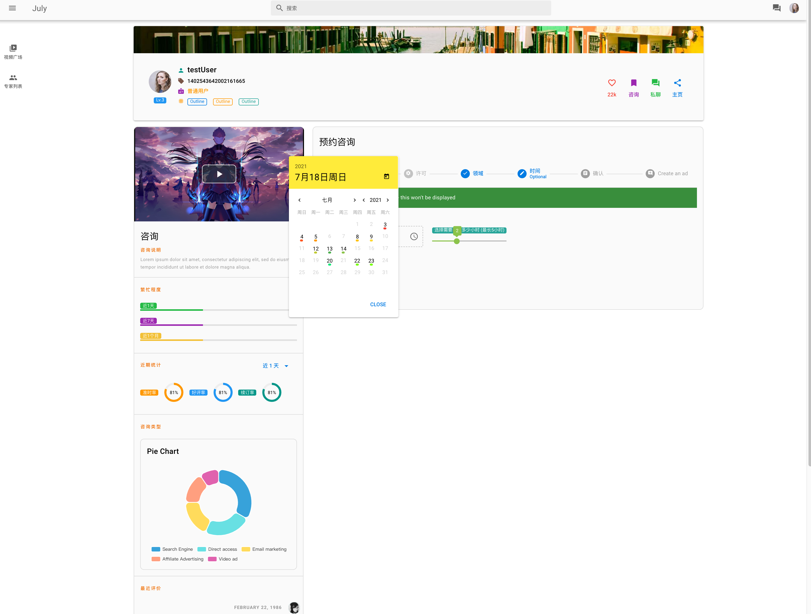
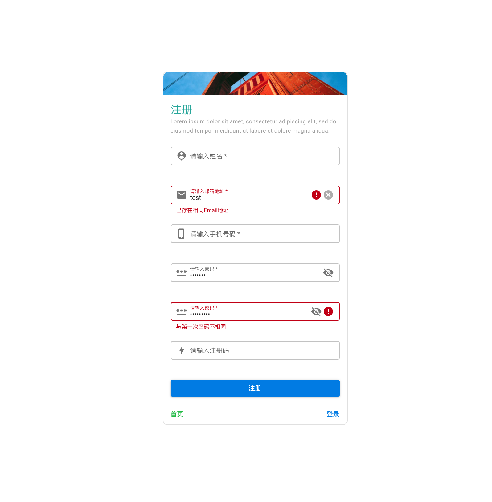

## 基于微服务的在线咨询项目网站

### 关于项目 (About)

​    此项目是用Spring Cloud Alibaba实现的**前后端分离**的 **微服务**项目，项目主要功能是在线实时对话、在线实时视频聊天、视频上传、在线观看视频，还有一些登录、注册和基础的权限控制等。

​	Functions: real-time online chat and 1v1 meeting on this website, upload video file and watching these online, login and register. there is a front-end and back-end separation and microservices technology architecture  , etc.

### 相关技术 (Technologies)

* Spring Cloud: Hoxton.SR8 ;   Srping Boot: 2.3.2.RELEASE ; Spring Cloud Alibaba: 2.2.5.RELEASE; 

  Spring Cloud Alibaba的版本和其它各个中间件的版本要求匹配，可以参照[官方版本说明](https://github.com/alibaba/spring-cloud-alibaba/wiki/%E7%89%88%E6%9C%AC%E8%AF%B4%E6%98%8E) (Middleware version notes from offcial)

* 注册中心、配置管理和服务总线(service discovery, configuration and service management platform): [Nacos](https://nacos.io/en-us/)

* 服务调用: [OpenFeign](https://github.com/OpenFeign/feign)

* 服务降级(serice flow-control sentinel): [Sentinel](https://sentinelguard.io/en-us/index.html)

* 服务网管: [Spring Cloud Gateway](https://spring.io/projects/spring-cloud-gateway)

* 分布式事务(distributed transaction solution): [Seata](http://seata.io/en-us/)

* Nacos、Nginx、seata-server、mysql db、redis，这些都用**Docker-compose**编排容器化处理，详细内容与配置请看项目根目录docker-compose.xml文件 ( these are all put into containers by docker-compose).
* 在线实时会话(real-time chat and meeting on browser): 在线聊天是基于Websockt实现 ([stomp.js](https://github.com/stomp-js/stompjs)) 。而在线视频是基于WebRTC实现点对点视频会话，WebRTC的信令服务器是基于Webscoket(Java)实现(信令服务器参照meet-serivce)。(Online chat is implemented using Websockt, and online meeting implemented using **WebRTC**,  WebRTC's **signaling server** is implemented using **WebSocket**(Java, please ref java code biz-meeting-serivce))
* 在线会议可以进行线下实时录制(real-time **recording** on browser)：使用[videojs-record](https://collab-project.github.io/videojs-record/) (RecordRTC)可以进行实时会议录制生成视频文件(please ref meeting.vue)。然后通过上传到后台服务器(biz-video-service)，后端可以执行异步任务来从视频文件中截取其中一个帧图片作为视频的画报(The back-end biz-video-serivce  can start an asynchronous task to capture one of the frames from the video file as a poster picture for the video)。
* 权限控制: 分布式的用户身份识别鉴权是基于**Oauth 2.0** 协议 (Spring Security OAuth)实现，而在分布式中为了不存储用户Session使用**JWT (Json web token)**，JWT里附加了用户基本信息与权限信息。资源服务器与权限服务器各保留RSA公密钥，权限服务器每次会给用户发送RSA加密过后的JWT，用户可以凭借此JWT访问资源服务器，资源服务器通过RSA公钥鉴定JWT并解密用户信息与用户权限，然后通过**spring security**对用户进行鉴权限制访问，所以无需重复让权限服务器鉴定JWT。
* 前端(front-end): 前端项目架构基于**[Vue.js](https://vuejs.org/)**，并且使用**Vue router**路由管理器和**Vuex**状态管理。使用**[Quasar](http://www.quasarchs.com/) **前端组件。前端是用Vue router，后端使用Restful API，从而实现了前后端分离(**a front-end and back-end separation**), 前端项目代码请参照july-web-page(front-end code reference)
* 还有一些像MySQL、Redis、Maven、[Mybatis-Plus](https://baomidou.com/en/)、[Druid](https://druid.apache.org/)、Log4j2等等都已经配置并使用。

### 演示 (Demo pictures)

### 说明

​	本项目前端和后端的代码与各种配置全都由我一个人独立完成，所以当前项目是基于Spring Cloud Ailibaba把微服务架构搭建好，配置了相关中间件，有些中间件只是配置上了，但因项目业务还未完善，所以未完全使用，如Seata何Sentinel，但是可以作为如何配置进行参考。主要功能也暂时实现了登录、注册、在线实时会话视频聊天、会议录制、视频文件上传、在线播放等主要业务。剩下的都是重复性的CRUD业务，待后续慢慢实现，但项目还是可以运行跑起来的，演示主要功能。总之，项目只作为学习参考用，如果对您有帮忙，麻烦给颗星支持一下，非常感谢！(In addition to repeatability CRUD at back-end, it only implements the main functions and is only reference for learning)   

​     Please help to light a star, thank you!!

